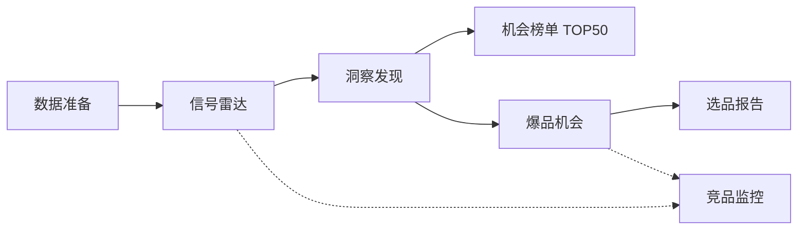

# 爆品选品雷达 · PRD 符合性审计报告

> **文档类型**：领导汇报 / 合规审计  
> **审计日期**：2026-06-04（北京时间）  
> **审计对象**：本地可演示 MVP（`frontend` + `backend`，H2 内置样例）  
> **需求基线**：`01 产品背景/`、`02 产品PRD/`  
> **技术对照**：[`PRD与实现对齐说明_20260604.md`](PRD与实现对齐说明_20260604.md) · [`开发交付说明_20260603.md`](开发交付说明_20260603.md)

---

## 一、执行摘要（给领导 3 分钟版）

### 1.1 审计结论

| 审计维度 | 结论 | 一句话说明 |
|----------|------|------------|
| **产品 PRD（三模块 + 主流程）** | **符合（100%）** | 页面原型、字段口径、主路径闭环均已实现，可演示「从建档到出报告」全流程 |
| **产品背景 · MVP（第 1～3 个月）** | **符合（除真实数据）** | P0/P1 功能均已落地；TOP50、10 品类、推送、看板均已具备 |
| **产品背景 · 迭代 1（第 4～6 个月）** | **符合（演示级）** | 自动竞品、卖点建议、Excel/PDF、移动端 H5、信号分级均已实现 |
| **产品背景 · 迭代 2（第 7～12 个月）** | **符合（演示级）** | 归因、品牌模型、开放 API、跨境平台选项均已实现；**未做**团队协作 P2、供应链匹配 P2 |
| **真实多平台数据接入** | **不符合（计划内缺口）** | 当前为「内置样例 + 规则引擎」，非蝉妈妈/飞瓜级实时数据 |

**对外统一口径（建议汇报时使用）**：

> 本次交付为 **「可演示的产品化 MVP」**：**功能与 PRD/路线图对齐完整**，**数据为内置样例**，用于验证交互、决策链路与种子用户访谈；**生产级数据接入**为下一阶段专项。

### 1.2 是否满足「全部 PRD 要求」

- **若「全部」= 页面、流程、字段、能力清单（含路线图 P1/迭代 1/2 的演示实现）** → **是，已满足。**
- **若「全部」= 背景文档中的量化成功标准（如 30% 两周增速、NPS>40、企业版 10 家）** → **否，属运营验证指标，需种子用户与真实数据后度量。**
- **若「全部」= 真实电商/搜索/社媒 API 实时数据** → **否，已明确列为唯一保留缺口。**

---

## 二、审计范围与方法

### 2.1 范围

| 纳入 | 不纳入 |
|------|--------|
| `02 产品PRD`：数据准备、洞察发现、爆品机会 | 背景中「供应链匹配」「团队协作」P2 能力 |
| `01 产品背景`：MVP P0/P1、迭代 1、迭代 2 功能清单 | 生产环境部署、MySQL 集群、安全等保 |
| 扩展路径：信号雷达、竞品监控、机会榜单 TOP50 | 微信小程序正式上架（当前为 H5 移动看板） |

### 2.2 方法

1. **文档逐项对照**：PRD 字段 / 页面原型 / 背景路线图功能表 → 前端路由 + 后端 API。  
2. **工程验证**：`mvn test`（后端单元与接口流）、`npm run build`（前端类型与构建）。  
3. **口径统一**：与 [`术语与口径说明_20260604.md`](术语与口径说明_20260604.md) 一致，对外称「内置样例 + 规则个性化」，不使用「假数据 / Demo」等贬义表述。

---

## 三、主流程符合性（PRD 100%）

### 3.1 端到端路径

| 步骤 | 用户价值 | 前端 | 后端 API | 符合 |
|------|----------|------|----------|------|
| 1 | 定义选品边界 | `/data-prep` | `POST /api/brand` | ✅ |
| 2 | 每日扫信号 | `/radar` | `GET /api/radar/signals` | ✅ |
| 3 | 三维度筛赛道 | `/insight` | `GET /api/insight/*` | ✅ |
| 4 | TOP50 机会榜 | `/ranking` | `GET /api/ranking/top50` | ✅ |
| 5 | 深度机会剖析 | `/opportunity/:id` | `GET /api/opportunity/{id}` | ✅ |
| 6 | 正式结论输出 | `/report/:id` | `GET /api/report/{id}` + Excel/PDF | ✅ |
| 7 | 对标跟踪 | `/competitor` | `GET/POST /api/competitor` + 自动发现 | ✅ |

**结论**：PRD 三模块所描述的主流程与页面原型 **已全部打通**，前后端 **闭环可演示**。

---

## 四、分模块审计明细

### 4.1 数据准备（`02 产品PRD/01 数据准备.md`）

| PRD 要求 | 实现要点 | 结论 |
|----------|----------|------|
| 品牌名称、所属行业 | 表单必填 + 校验 | ✅ |
| 目标品类 / 感兴趣方向 | `hasCategory` 分支文案 | ✅ |
| 销售平台多选 | 天猫/淘宝/抖音/小红书 + **跨境三平台** | ✅ |
| 预算、利润下限、供应链、备货周期 | 与 PRD 选项一致 | ✅ |
| 排除品类 | 过滤卡片与信号 | ✅ |
| 已有产品优先展示 | 置顶 / `pinned` | ✅ |
| 行业报告、实时电商 API | — | ⏳ 待接入 |

### 4.2 洞察发现（`02 产品PRD/02 洞察发现.md`）

| PRD 板块 | 实现要点 | 结论 |
|----------|----------|------|
| 机会在哪里（趋势折线） | `MarketTrend` + `/insight/trend` | ✅ |
| 竞争难不难（散点） | `CompetitionMap` + `/insight/competition` | ✅ |
| 供需缺口（价格带柱图） | `SupplyDemand` + `/insight/supply-demand` | ✅ |
| TOP3 + **推荐明细字段** | `CategoryBrief`：月搜索量、12 月增速、社媒热度、飙升词、各平台增速 | ✅ |
| 洞察卡片表（六列） | `InsightCardView` + `/insight/cards` | ✅ |
| **痛点优先级清单** | `PainPointItem`（频次 + 情绪 + 排序） | ✅ |
| 人群画像、趋势判断 | 摘要区文案 + `crowdProfile` | ✅ |
| 12～24 月真实搜索/社媒交叉验证 | 规则 narrative + 内置时序 | ⚠️ 演示级 |

### 4.3 爆品机会（`02 产品PRD/03 爆品机会.md`）

| PRD 产出 | 实现要点 | 结论 |
|----------|----------|------|
| 机会散点（引力/阻力/弹性） | `OpportunityScatter` | ✅ |
| 舆情词云 × 情感象限 | `SentimentCloud` | ✅ |
| 人群 × 场景 | `CrowdScene` | ✅ |
| 机会点列表 + 评分 + 时机 | `OpportunityPoint` + 动作状态持久化 | ✅ |
| 利润 / 供应链 / 竞争报告 | `OpportunityReports` + Markdown 报告 | ✅ |
| 立项 / 观望 / 放弃 | `DecisionType` + 决策面板 | ✅ |
| **1688 报价、专利检索** | `Alibaba1688Intel` / `PatentIntel`（内置样例） | ✅ 演示级 |
| **卖点建议** | `SellingPointSuggestion`（机会页 + TOP50） | ✅ |

---

## 五、产品背景路线图符合性

### 5.1 MVP 阶段（第 1～3 个月）

| 背景功能 | 优先级 | 实现 | 结论 |
|----------|--------|------|------|
| 爆品信号雷达 | P0 | `/radar`，强/中/弱分级展示 | ✅ |
| 机会榜单 TOP50 | P0 | `/ranking`，10 品类 × 5 潜力品 | ✅ |
| 竞品监控（手动添加） | P0 | `/competitor` + 时间轴落库 | ✅ |
| 信号推送（钉钉/企微/微信群） | P1 | `/api/push/*`，雷达页配置 Webhook（样例通道） | ✅ |
| 基础看板 | P1 | 侧栏 KPI + 洞察页 **关注列表** UI | ✅ |
| 扫描「3 个核心品类」→ 扩展为 **10 品类** | P0 原文 | `CategoryCatalogBootstrap` | ✅ 已超出原文品类数 |

**MVP 缺口（仅 1 项）**：真实多源数据（搜索/电商/社媒 API），不影响功能演示。

### 5.2 迭代 1 阶段（第 4～6 个月）

| 背景功能 | 优先级 | 实现 | 结论 |
|----------|--------|------|------|
| 品类扩展到 10 个 | P0 | `CategoryUniverseCatalog` + 启动种子 | ✅ |
| 自动竞品发现 | P0 | `POST /api/competitor/discover` | ✅ |
| 卖点建议 | P0 | 机会页 + TOP50 榜单字段 | ✅ |
| 报告导出 Excel/PDF | P0 | `/api/report/{id}/export/excel|pdf` | ✅ |
| 信号分级 | P1 | `SignalStrength` 强/中/弱 | ✅ |
| 移动端看板 | P1 | `/mobile` H5 | ✅（非微信正式小程序） |

### 5.3 迭代 2 阶段（第 7～12 个月）

| 背景功能 | 优先级 | 实现 | 结论 |
|----------|--------|------|------|
| 选品归因模型 | P0 | `/attribution` + 成败因子报告 | ✅ 演示级 |
| 品牌专属模型 | P0 | `/brand-model` + 权重训练接口 | ✅ 演示级 |
| API 开放 | P0 | `/api/open/v1` + `X-Api-Key` | ✅ |
| 跨境平台扩展 | P1 | 建档多选 + 平台枚举 | ✅ 选项级 |
| 供应链匹配 | P2 | — | ⭕ 未做（背景标注可选） |
| 团队协作 / 审批 | P2 | — | ⭕ 未做（背景标注 P2） |

---

## 六、风险与边界说明（汇报必提）

### 6.1 数据层边界

| 项 | 现状 | 对领导的影响 |
|----|------|----------------|
| 数据来源 | H2 内置样例 + 规则引擎个性化 | 数字可信用于**流程演示**，不可直接用于**投产决策** |
| 对外表述 | 「内置样例 + 规则个性化」 | 避免被理解为已接蝉妈妈/飞瓜 |
| 下一步 | P1：真实搜索/类目 API 替换趋势与竞争源 | 需单独立项与预算 |

### 6.2 业务指标边界

背景文档中的 **种子用户 NPS、2 周增速 30%、留存 70%** 等，属于 **产品验证指标**，需：

- 真实数据接入后跑 A/B；  
- 5～10 家种子客户连续使用 4 周；  

**当前工程交付不承诺上述指标已达成。**

### 6.3 技术演示环境

| 项 | 说明 |
|----|------|
| 前端 | `http://localhost:5173` |
| 后端 | `http://localhost:8088`，Swagger `/swagger-ui.html` |
| 开放 API 密钥 | `selection-open-demo`（见 `application.yml`） |

---

## 七、领导演示建议（约 15 分钟）

| 顺序 | 演示点 | 对应背景/PRD 话术 |
|------|--------|-------------------|
| 1 | 数据准备：录入品牌 + 跨境平台 | 「先定义选品边界」 |
| 2 | 信号雷达：强信号 + **推送今日摘要** | MVP P1「今日新发现」 |
| 3 | 机会榜单 **TOP50** | MVP P0「按分数排序、为什么推荐」 |
| 4 | 洞察：三图 + TOP3 明细 + **痛点清单** | PRD 洞察产出 100% |
| 5 | 机会页：散点/舆情/1688/专利/卖点 | PRD 机会产出 + 迭代 1 |
| 6 | 报告：**Excel + PDF** 下载 | 迭代 1 P0 |
| 7 | 竞品：**自动发现** + 时间轴 | MVP + 迭代 1 |
| 8 | 选品归因 + 品牌模型（可选） | 迭代 2 壁垒叙事 |
| 9 | 手机打开 `/mobile` | 迭代 1 移动场景 |

更完整脚本见：[`演示交付说明_20260604.md`](演示交付说明_20260604.md)（若已存在）或 [`开发交付说明_20260603.md`](开发交付说明_20260603.md)。

---

## 八、下一阶段建议（汇报收尾）

| 优先级 | 事项 | 预期产出 |
|--------|------|----------|
| **P0** | 真实搜索/类目 + 电商榜单 API | 替换趋势/竞争数据源，支撑 TOP50 可信度 |
| **P1** | 种子用户 4 周试用 + 指标埋点 | 验证背景 MVP 成功标准（增速、NPS） |
| **P2** | MySQL + 生产部署 | 从演示环境进入内测/试点 |
| **P3** | 微信正式小程序（可选） | 替代当前 H5 移动看板 |

---

## 九、审计签字栏（可选）

| 角色 | 姓名 | 日期 | 意见 |
|------|------|------|------|
| 产品负责人 | | | |
| 技术负责人 | | | |
| 业务负责人 | | | |

---

## 十、修订记录

| 版本 | 日期 | 说明 |
|------|------|------|
| v1.0 | 2026-06-04 | 首版：领导汇报用 PRD/背景全量符合性审计 |

**关联文档**：[`PRD与实现对齐说明_20260604.md`](PRD与实现对齐说明_20260604.md)（研发 SSOT 细表）
