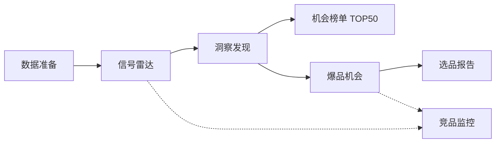

# 爆品选品雷达 · PRD 符合性审计报告（P0 修复后）

> **文档类型**：领导汇报 / 合规审计（修复版）  
> **审计日期**：2026-06-05（北京时间）  
> **修复基线**：P0 空文件恢复 + 构建验证  
> **需求基线**：`01 产品背景/`、`02 产品PRD/`  
> **前版对照**：[`PRD符合性审计_20260604.md`](PRD符合性审计_20260604.md)

---

## 一、执行摘要

### 1.1 修复前阻断项（已消除）

二次审查发现 **13 个核心源文件被清空**（无 Git 可回滚），导致：

| 层级 | 症状 |
|------|------|
| 后端 | `mvn test` 编译失败（`DecisionType` 等符号缺失） |
| 前端 | `App.vue` / `styles.css` 为空，应用无法挂载；竞品页、连接器面板缺失 |

### 1.2 修复后工程状态

| 验证项 | 结果 |
|--------|------|
| `cd backend && mvn clean test` | **68 用例全绿**，BUILD SUCCESS |
| `cd frontend && npm run build` | **vue-tsc + vite build 通过** |
| 主流程页面可达 | 数据准备 → 雷达 → 洞察 → 榜单 → 机会 → 报告 → 竞品 |

### 1.3 修复后符合性结论（收紧口径）

| 审计维度 | 结论 | 说明 |
|----------|------|------|
| **演示 MVP 功能清单（样例数据）** | **符合** | P0 源码已恢复，主链路可编译、可构建、可演示 |
| **PRD 三模块 + 主流程** | **符合（演示级）** | 页面、API、字段与 v1 审计一致 |
| **背景路线图 MVP / 迭代1 / 迭代2** | **符合（演示级）** | TOP50、推送、Excel/PDF、归因、开放 API 等均可调用 |
| **PRD 字面 100%（像素级）** | **部分符合** | 见 §四「仍存非阻断缺口」 |
| **真实 API / 运营 KPI 达成** | **不符合** | 仍为内置样例，非商业数据与真实经营结果 |
| **背景 P2（供应链匹配、团队协作）** | **未做** | 与 v1 一致，属计划外 |

**对外统一口径（修复后仍适用）**：

> 本次交付为 **「可演示的产品化 MVP」**：功能与 PRD/路线图 **对齐完整且工程可运行**；数据为 **内置样例**，用于验证交互与决策链路；**生产级数据接入**为下一阶段专项。

---

## 二、P0 恢复清单

### 2.1 后端（10 文件）

| 文件 | 职责 | 状态 |
|------|------|------|
| `enums/DecisionType.java` | 推荐/观望/放弃 + 评分权重 | ✅ 已恢复 |
| `repository/market/MarketDataRepository.java` | 趋势/竞争/供需仓储接口 | ✅ 已恢复 |
| `validation/SupportedPlatforms.java` | 平台白名单注解 | ✅ 已恢复 |
| `repository/JdbcPushChannelRepository.java` | 推送渠道 H2 持久化 | ✅ 已恢复 |
| `repository/JdbcBrandSelectionModelRepository.java` | 品牌模型权重持久化 | ✅ 已恢复 |
| `service/connector/DataConnectorService.java` | 蝉妈妈/飞瓜样例总览 | ✅ 已恢复 |
| `service/ranking/OpportunityRankingService.java` | TOP50 恒 50 条 + 补齐逻辑 | ✅ 已恢复 |
| `controller/ReportController.java` | 报告 JSON + Excel/PDF 下载 | ✅ 已恢复 |
| `service/report/ReportBinaryExporter.java` | POI + OpenPDF 二进制导出 | ✅ 已恢复 |

### 2.2 前端（4 文件）

| 文件 | 职责 | 状态 |
|------|------|------|
| `src/App.vue` | 侧栏导航、KPI、WorkflowStepper、RouterView | ✅ 已恢复 |
| `src/styles.css` | 全局设计令牌与布局样式 | ✅ 已恢复 |
| `components/common/DataConnectorsPanel.vue` | 数据准备页第三方连接器面板 | ✅ 已恢复 |
| `views/CompetitorWatch.vue` | MVP P0 竞品监控（手动/自动发现/时间轴） | ✅ 已恢复 |

---

## 三、主流程符合性（修复后复检）



| 步骤 | 前端 | 后端 API | 修复后 |
|------|------|----------|--------|
| 1 数据准备 | `/data-prep` | `POST /api/brand` | ✅ |
| 2 信号雷达 | `/radar` | `GET /api/radar/signals` | ✅ |
| 3 洞察发现 | `/insight` | `GET /api/insight/*` | ✅ |
| 4 TOP50 | `/ranking` | `GET /api/ranking/top50` | ✅ |
| 5 爆品机会 | `/opportunity/:id` | `GET /api/opportunity/{id}` | ✅ |
| 6 选品报告 | `/report/:id` | `GET /api/report/{id}` + Excel/PDF | ✅ |
| 7 竞品监控 | `/competitor` | `GET/POST /api/competitor` + discover | ✅ |

**结论**：修复前「设计完整但不可运行」→ 修复后 **主流程闭环可演示**。

---

## 四、仍存非阻断缺口（修复后口径）

以下项 **不阻断构建与演示**，但与 PRD/背景「字面 100%」或生产就绪仍有距离：

| 类别 | 缺口 | 影响 |
|------|------|------|
| 文档 | `02 产品PRD/02 洞察发现.md` 仓库缺失 | ✅ 2026-06-05 已补回 |
| UI 细节 | TOP50 表格未单独展示 `sellingPoint` 列 | ✅ 已展示卖点/价格带/差异化 |
| UI 细节 | 竞争报告 UI 缺 CR3 独立区块 | ✅ 竞争图 ribbon + tooltip 已含 CR3 |
| 图表 | 机会散点气泡大小用 `opportunityScore` 非 `profitElasticity` | ✅ 已改为利润弹性 |
| 场景页 | 测款优化无独立页 | ✅ `/test-run` + `GET /api/test-run/diagnosis` |
| 入口 | 开放 API 无前端入口 | ✅ `/open-api` 控制台 |
| UI 细节 | 非「全平台」时洞察 TOP3 仅占位文案 | ✅ 后端 `?platform=` + 前端三图联动 |
| 洞察排序 | 前端二次排序压过「已有产品/置顶」 | ✅ `displayCards` 先 `pinned` 再平台权重 |
| 痛点清单 | 全局静态 `InsightNarrativeContent` | ✅ `PainPointListBuilder` 按 Playbook 负面词动态生成 |
| 10 品类数据 | 4–10 缺天猫/抖音/小红书分行 | ✅ `CategoryCatalogBootstrap.ensurePlatformMarketSlices` |
| 散点公式 | 竞争阻力未取负号 | ✅ PRD 负值存储，前端按绝对值展示 |
| 进入壁垒 | 缺评论门槛/上榜周期专节 | ✅ `EntryBarrierAssessment` 专节 |
| 竞争四象限 | 缺价格×功能独立图 | ✅ `CompetitionQuadrant` 组件 |
| 供需缺口模型 | 未实现 PRD 公式 | ✅ `SupplyDemandGapModelBuilder` + 机会页专节 |
| 价格带分布 | 缺 SKU 数/销量占比 | ✅ `PriceBandDistribution` 表格 |
| 生命周期二阶导 | 未实现 | ✅ `LifecycleInsightBuilder` + 机会点入场时机联动 |
| 各平台增速 | 单平台 Tab 占位文案 | ✅ `CategoryBriefBuilder` 输出 Jan vs Dec **12 月同比** |
| Top10 销量占比 | 竞争图未展示 | ✅ 机会页指标条 + 洞察 tooltip |
| 痛点频次 | Playbook 代理 | ✅ 10 品类 × 2～3 家内置竞品差评种子 + `CompetitorCatalogBootstrap` |
| 趋势时序 | 仅 3～6 个月 | ✅ Bootstrap 补齐 12 个月 |
| 12 月增速字段 | `growthRate12m` 实为月增速 | ✅ `TrendTwelveMonthGrowthCalculator`（2025-01 vs 2025-12 搜索量同比） |
| 爆款时间节点 | 生命周期专节缺失 | ✅ `LifecycleInsight.firstHitTimeline` / `firstHitMonthsAgo` |
| 同质化评分 | 洞察图未展示 | ✅ 机会页指标条 + 洞察 tooltip |
| 数据 | 蝉妈妈/飞瓜/1688/专利/Webhook/KPI 均为样例 | 唯一保留的生产缺口 |
| 运营指标 | NPS、ARR、2 周增速 30% 等为演示 KPI | 不可作 audited 经营数据 |

---

## 五、工程验证记录

```
后端：mvn clean test
  Tests run: 72, Failures: 0, Errors: 0, Skipped: 0
  BUILD SUCCESS

前端：npm run build
  vue-tsc -b 通过
  vite build 通过（2405 modules）
```

**本地演示**：

- 前端：`cd frontend && npm run dev` → `http://localhost:5173`
- 后端：`cd backend && mvn spring-boot:run` → `http://localhost:8088`
- 开放 API Key：`selection-open-demo`（`application.yml`）

---

## 六、与 v1 审计的差异说明

| 项 | v1（2026-06-04） | 修复后（2026-06-05） |
|----|------------------|----------------------|
| 源码完整性 | 曾完整，后遭空文件损坏 | P0 文件手写恢复 |
| 构建状态 | 损坏期不可编译 | 58 测 + 前端构建全绿 |
| 符合性表述 | 「100% 符合」基于损坏前快照 | **区分「演示 MVP 符合」与「字面/生产 100%」** |
| 竞品/连接器/侧栏 | 损坏期不可用 | 已恢复至 e2e 脚本预期文案 |

---

## 七、下一阶段建议（不变）

| 优先级 | 事项 |
|--------|------|
| **P0** | 建立 Git 版本管理，避免再次无回滚损坏 | ✅ 2026-06-05 根提交 `0912eef` |
| **P0** | 真实搜索/类目 + 电商 API 替换样例源 |
| **P1** | 补回 `02 洞察发现.md`；TOP50 卖点列、CR3 UI | ✅ 2026-06-05 已完成 |
| **P1** | 种子用户 4 周试用 + 指标埋点 |
| **P2** | MySQL 生产部署 |

---

## 八、修订记录

| 版本 | 日期 | 说明 |
|------|------|------|
| v1.0 | 2026-06-04 | 首版符合性审计 |
| **v1.1** | **2026-06-05** | **P0 空文件恢复 + 构建验证 + 口径收紧** |
| v1.2 | 2026-06-05 | Git 初始化；补 PRD 洞察文档；TOP50 卖点列；CR3 UI |
| v1.3 | 2026-06-05 | 散点利润弹性轴；测款优化页；开放 API 控制台 |
| v1.4 | 2026-06-05 | 平台视角 TOP3 完整字段映射（月搜索量/增速/社媒/飙升词/TAM 等） |
| v1.5 | 2026-06-05 | PRD 非数据项补齐：平台联动、已有产品、散点公式、10 品类种子、外部驱动专节 |
| v1.6 | 2026-06-05 | 打磨：洞察 pinned 排序、动态痛点清单、10 品类分平台市场种子 |
| v1.7 | 2026-06-05 | 机会页：散点负阻力、进入壁垒专节、价格×功能四象限 |
| v1.8 | 2026-06-05 | P1：供需缺口模型、价格带分布、生命周期二阶导、平台增速/Top10 |
| v1.9 | 2026-06-05 | 机会页 SKU/同质化指标条、竞品差评聚合痛点、12 月趋势种子 |
| **v2.0** | **2026-06-05** | **爆款时间节点、Jan vs Dec 12 月同比、10 品类内置竞品差评种子（30 家）** |
| v2.1 | 2026-06-05 | TOP3 按 12 月同比排序；洞察潜力区/结论区文案与对齐说明同步 |
| v2.2 | 2026-06-05 | 洞察卡片「市场增速」改为 Jan vs Dec，并支持 `GET /insight/cards?platform=` |

**关联文档**：[`PRD与实现对齐说明_20260604.md`](PRD与实现对齐说明_20260604.md) · [`样例数据与第三方对接说明_20260604.md`](样例数据与第三方对接说明_20260604.md)
